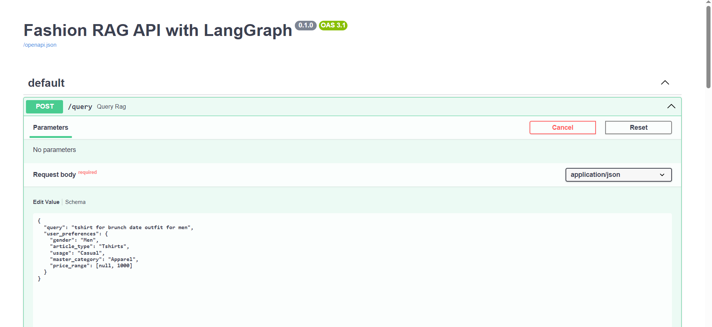
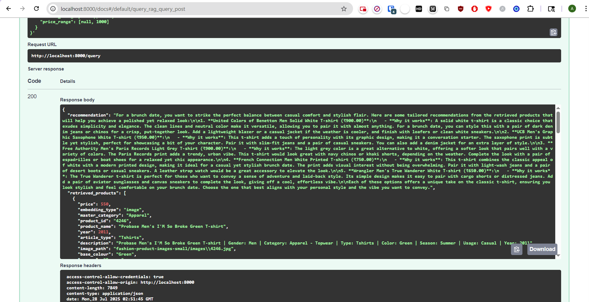
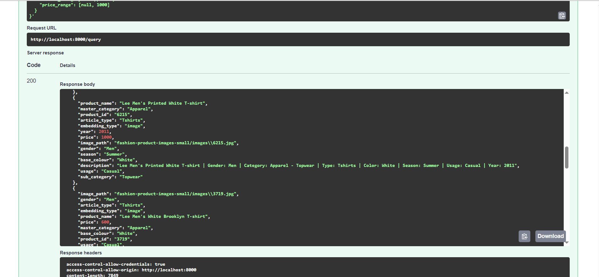
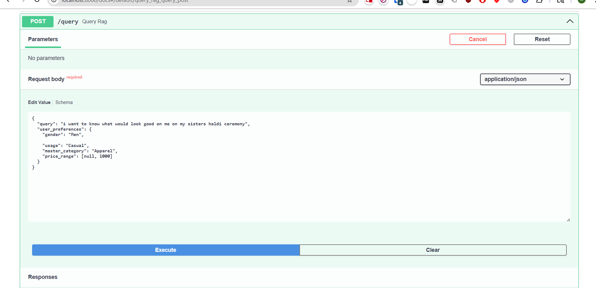
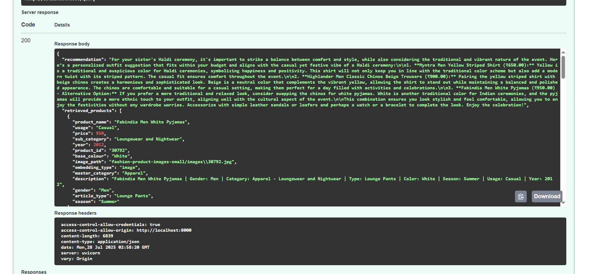

# Fashion RAG API

This project is a sophisticated, FastAPI-powered recommendation engine that provides personalized fashion advice. It leverages a Retrieval-Augmented Generation (RAG) pipeline built with LangGraph, using a fine-tuned CLIP model for multi-modal embeddings and ChromaDB as the vector store.

## ✨ Features

- **Natural Language Queries**: Ask for fashion advice in plain English (e.g., "What should I wear for a brunch date?").
- **Advanced Metadata Filtering**: Refine searches using structured user preferences like gender, category, style (usage), and price range.
- **AI-Powered Stylist**: Utilizes GPT-4.1-mini to generate thoughtful, human-like fashion recommendations based on retrieved products.
- **High-Performance**: Built on FastAPI for high-speed, asynchronous request handling.
- **Scalable Workflow**: Uses LangGraph to orchestrate the complex RAG workflow in a clear and maintainable state machine.
- **Rich Logging**: Integrated with Loguru for detailed, structured, and colorful logging.

## 🛠️ Technology Stack

- **Backend Framework**: FastAPI
- **AI/ML Orchestration**: LangChain & LangGraph
- **Vector Database**: ChromaDB
- **Embedding Model**: `dejasi5459/clip-fashion-embeddings-final-10k-ft` (SentenceTransformer)
- **Language Model**: OpenAI GPT-4o
- **Data Validation**: Pydantic
- **Logging**: Loguru

## ⚙️ Setup and Installation

Follow these steps to get the application running locally.

### 1. Prerequisites

- Python 3.9+
- An existing ChromaDB vector database located in a `fashion_vector_db` directory, generated by the `embeddings_generation.ipynb` notebook.

### 2. Clone the Repository

```bash
git clone <your-repo-url>
cd <your-repo-directory>
```

### 3. Create a Virtual Environment

```bash
python -m venv venv
source venv/bin/activate  # On Windows, use `venv\Scripts\activate`
```

### 4. Install Dependencies

Create a `requirements.txt` file with the necessary packages and install them.

**`requirements.txt`:**
```
fastapi
uvicorn[standard]
pydantic
langchain
langchain-openai
langchain-huggingface
langchain-chroma
langgraph
python-dotenv
loguru
```

**Installation Command:**
```bash
pip install -r requirements.txt
```

### 5. Configure Environment Variables

Create a `.env` file in the root directory and add your OpenAI API key:

```
OPENAI_API_KEY="your_openai_api_key_here"
```

## 🚀 Running the Application

Once the setup is complete, you can run the application using Uvicorn:

```bash
uvicorn app-simple:app --reload
```

The API will be available at `http://localhost:8000`. You can access the interactive API documentation at `http://localhost:8000/docs`.

## 🔗 API Endpoints

### `POST /query`

This is the main endpoint for getting fashion recommendations. It takes a natural language query and an optional set of user preferences to filter the results.

#### Request Body

```json
{
  "query": "string",
  "user_preferences": {
    "gender": "string (e.g., 'Men', 'Women')",
    "usage": "string (e.g., 'Casual', 'Formal', 'Sports')",
    "master_category": "string (e.g., 'Apparel', 'Footwear')",
    "price_range": "[min_price, max_price]"
  }
}
```

#### cURL Examples

**1. Simple Query (No Filtering)**

```bash
curl -X 'POST' \
  'http://localhost:8000/query' \
  -H 'accept: application/json' \
  -H 'Content-Type: application/json' \
  -d '{
  "query": "a cool t-shirt for summer"
}'
```

**2. Query with User Preferences (Filtering)**

This example looks for a casual men's shirt for less than ₹1500.

```bash
curl -X 'POST' \
  'http://localhost:8000/query' \
  -H 'accept: application/json' \
  -H 'Content-Type: application/json' \
  -d '{
  "query": "a nice shirt for a date",
  "user_preferences": {
    "gender": "Men",
    "usage": "Casual",
    "master_category": "Apparel",
    "price_range": [null, 1500]
  }
}'
```

#### Success Response

A successful request returns a JSON object containing the AI-generated recommendation and a list of the products that were used as context.

```json
{
  "recommendation": "For a date, you want something stylish yet comfortable. A great option would be the 'Mast & Harbour Men Navy Blue & Grey Regular Fit Checked Casual Shirt'. The navy blue and grey check pattern is classic and versatile, making it easy to pair with dark jeans or chinos for a smart-casual look. It's perfect for a relaxed setting like a coffee shop or a walk in the park.",
  "retrieved_products": [
    {
      "product_id": "12345",
      "product_name": "Mast & Harbour Men Navy Blue & Grey Regular Fit Checked Casual Shirt",
      "gender": "Men",
      "master_category": "Apparel",
      "sub_category": "Topwear",
      "article_type": "Shirts",
      "base_colour": "Navy Blue",
      "season": "Fall",
      "usage": "Casual",
      "price": 1399.0,
      "image_path": "fashion-product-images-small/images/12345.jpg",
      "description": "...",
      "year": 2016
    }
  ]
}
```

## 📸 Screenshots

*FastAPI Docs Interface*



*Structured Logging Output*



*Similarity Search Output*


*FastAPI Input and Output*


*FastAPI Output*


## 🧠 How It Works: The RAG Workflow

The application uses a LangGraph-powered state machine to process each request:

1.  **State Initialization**: The workflow starts with the user's query and preferences.
2.  **Retrieve Node**:
    - The user preferences are parsed to create a metadata filter for ChromaDB.
    - The `FashionRAGRetriever` performs a similarity search against the vector database using the query and the metadata filter.
    - The top matching products are retrieved and added to the state.
3.  **Generate Node**:
    - The retrieved product data is formatted into a rich, detailed context.
    - A specialized prompt, instructing the LLM to act as a fashion stylist, is created.
    - The prompt, containing the user query and the product context, is sent to GPT-4o.
4.  **Final Response**: The LLM generates a detailed recommendation, which is returned to the user along with the list of source products.
